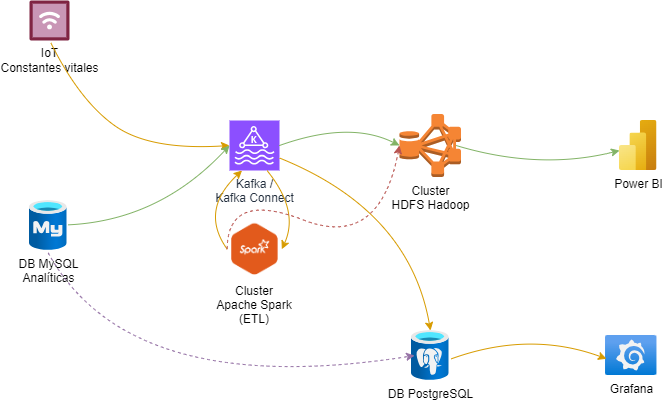

# Big Data Aplicado
## Proyecto Final

> Como proyecto final y para la evaluación del aprendizaje de todos los RAs del módulo, el alumnado realizara un proyecto completo que incluya la demostración de todo el Stack y los RAs del módulo, siguiente los requisitos que se expondrán a continuación

> La evaluación de este proyecto equivale a lo que sería el examen final del módulo.

> Desde el Departamento se darán los medios que estén a su alcance para dar soporte al proyecto.

### Requisitos

1. El proyecto deberá tener todo el stack de todos los sistemas vistos en clase perfectamente instalado, configurado y funcionando como un Sistema completo de Big Data, desde la ingesta de datos, ETL, BI y su visualización.
2. El alumnado elegirá el origen, los tipos y la temática de los datos que se van a procesar en el Sistema Big Data.
3. Deben establecer, desarrollar y justificar el tipo de conocimiento que van a obtener de los datos origen después de su ingesta y procesamiento (ETL) en el sistema. 
4. El procesamiento de los datos lo realizarán a través de SPARK, utilizando alguna de sus 3 APIs disponibles. Esto no quita que puedan realizar algún tipo de procesamiento de datos anteriormente, como por ejemplo en Kafka.
5. El sistema debe poder soportar la ingesta de datos tanto en batch como en streaming.
6. Los datos de origen podrán ser sintéticos, reales o una combinación de ambos.
7. Puedes usar las Api/s que creas necesaria/s. Incluso la creación de tus propios datos sintéticos en batch y streaming (Estos deben cumplir con los requisitos del puntos 1 al 3)
8. Todo el ETL realizado deberá estar correctamente desarrollado y justificado.
9. Se deberá añadir al stack algún sistema, servicio, ... de investigación propia (al menos 1, aunque puede añadir todos los que quieras). Se propone una lista de ellos, que podrán ser ampliados a propuesta del alumnado:
   1. AWS GLUE
   2. AWS S3
   3. Nifi
   4. Flink
   5. Tableau
   6. PowerBI
   7. Elasticsearch
   8. Kibana
   9.  RabbitMQ
   10. Otros (deben ser consensuados y aprobados)
10. **La calificación del proyecto se hará de forma global, dependiendo de los niveles de aprendizaje que se demuestres superados acorde al nivel de conocimiento que exige el módulo del CE**.

### Proyectos. Requisitos comunes

1. El sistema completo será, como mínimo (más la investigación propia):
   1. Apache Hadoop Common
   2. HDFS
   3. MapReduce
   4. Yarn
   5. Spark
   6. Kafka
   7. Grafana
2. Debe haber como mínimo 3 nodos en los clusters (en cada uno):
   1. Hadoop (HDFS/Yarn)
   2. Spark
   3. Kafka
3. Añade todos los nodos que necesites para desplegar todo el stack Big Data del proyecto.
4. Deben soportar acceso concurrente desde varios nodos Edge.

### Consideraciones

1. A mayor y mejor ETL y mayor y mejor Business Intelligence, mejor calificación.
2. Si un proyecto no tiene suficiente procesamiento de datos y obtención de conocimiento, mayor será la exigencia de la investigación propia o viceversa. 

### Recursos

1. Dejo algunos recursos de APis que quizá te resulten interesantes
   1. [A Collaborative List Of 1400+ Public APIs For Developers](https://publicapis.dev/)
   2. [Create AI-generated API endpoints](https://www.jsondataai.com/)
   3. [Public APIs](https://publicapis.io/)

---

# Sistema de Big Data para el ámbito sanitario

### Daniel Marín López

---

### 📗 Documentación del proyecto
---

* Página de la Wiki: https://github.com/Dansarasix-DML/Proyecto-final-Big-Data/wiki
* Documento PDF dentro del repo.
* Enlace Google Drive al PDF: https://docs.google.com/document/d/1PTMQJikNZtGECRgAtVwm7L9h7iRqjb_QNpt2o-4T8LE/edit?usp=sharing

### 📁 Archivos del proyecto
---

* https://github.com/Dansarasix-DML/Proyecto-final-Big-Data/tree/main/files

### 🗂️ Data generada del proyecto de ejemplo
---

* https://github.com/Dansarasix-DML/Proyecto-final-Big-Data/tree/main/data

### 🎬 Vídeos de demostración
---

* Primera parte: https://drive.google.com/file/d/1VAuXCKg-pSQuT2PcBIEHE_x1a6P3lQCN/view?usp=sharing
* Segunda parte: https://drive.google.com/file/d/160lGnDW1cFPY11tNXCuGfF7aGTFUHeoe/view?usp=sharing